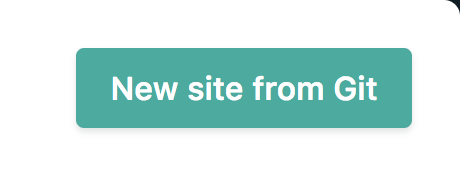
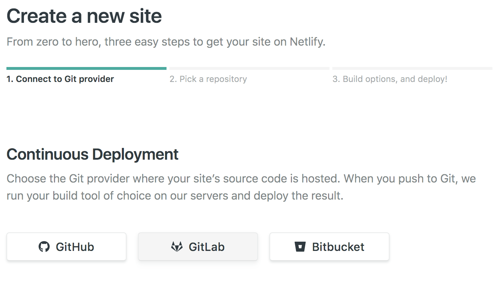
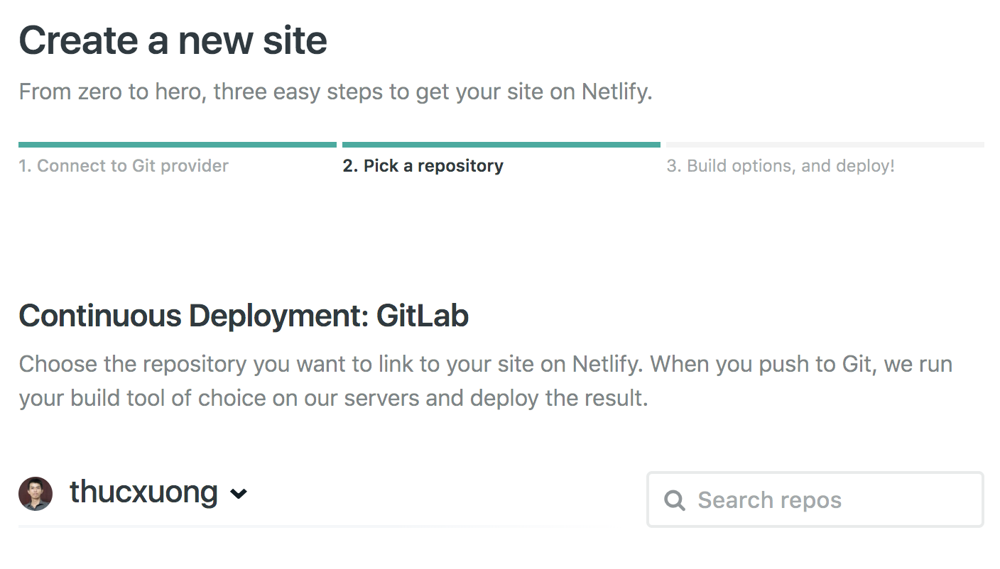
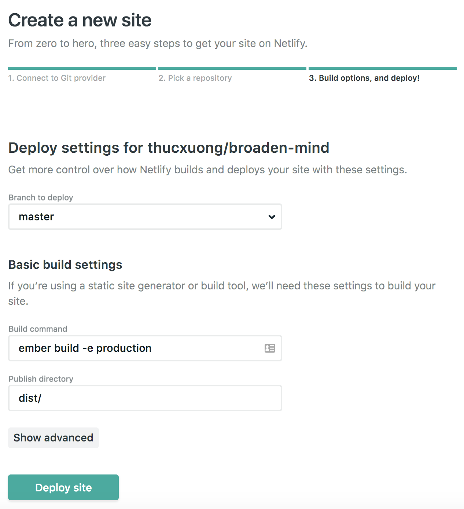
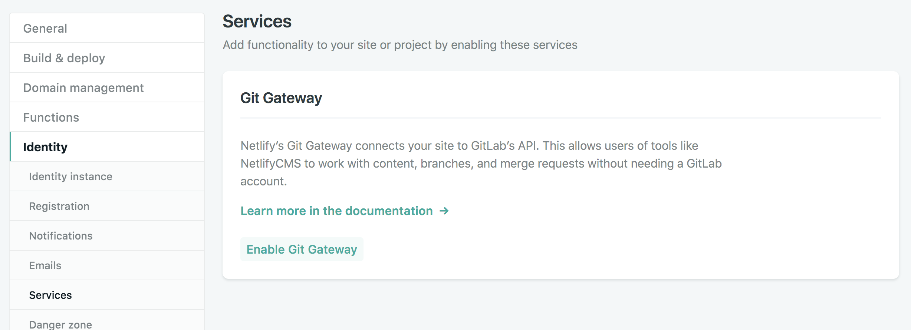
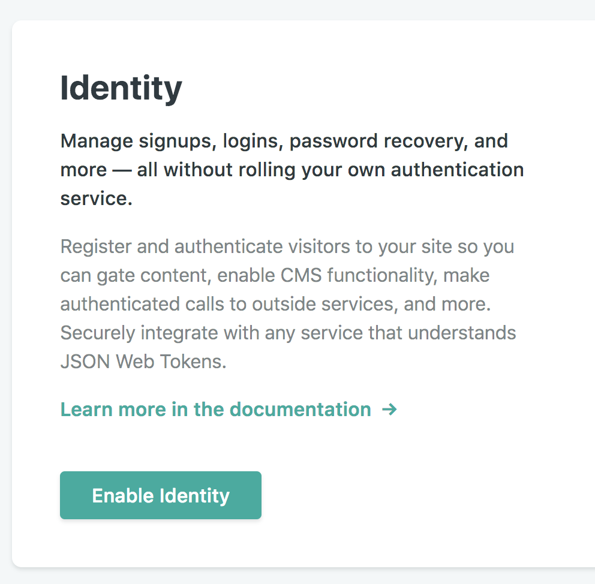
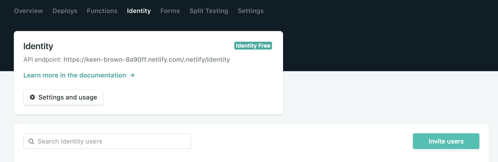
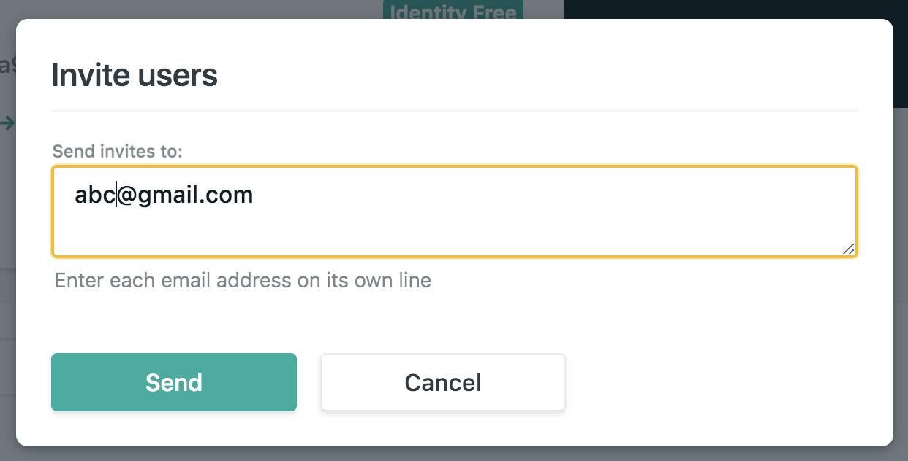

## Create your repo with Vuepress CN

This guides does not include the installation of [Vuepress](https://vuepress.vuejs.org/guide/getting-started.html), please check the installation guide of these SSG on their homepage.

## Clone Vuepress Netlify boilerplate

https://gitlab.com/itconsultis/boilerplate/vuepress-boilerplate

## Creating new theme

You could creating a new theme or edit current theme in `.vuepress/theme` folder with vue syntax

```bash
vuepress dev site
```

OR

```bash
yarn dev
```

## Prepare CMS authorization settings for admin registration, inviation, access

In your vue main layout, you have to add this line of script tag to your homepage.
This js file will be responsible for authorization on homepage.
With VueJS you could include it in the Layout file as `Layout.vue` is the entry point of whole app

```html
<div data-netlify-identity-menu></div>
<div data-netlify-identity-button>Login with Netlify Identity</div>

<script src="https://identity.netlify.com/v1/netlify-identity-widget.js"></script>
```

### ADMIN

The `config.yml` file should have format similar to this one, collections is a the presentation of your content types. Eg: Post, project, testimonial, ...

```yml
backend:
  name: git-gateway # Login by gitlab account. For netlify to know how to let user login to their CMS.
  repo: thucxuong/vuepress-test # Site repo
  branch: master # Deploy branch
media_folder: "site/.vuepress/public/images" # Media folder where you upload images
public_folder: "site/.vuepress/dist/" # Folder where your whole site will live in
## In our collection, I present 2 collection as examples for you to have better understanding
collections: # collection is the building-block of netlify, you could see it as content type
  - name: "doc" # Used in routes, e.g., /admin/collections/blog
    label: "Doc" # Used in the UI
    folder: "site/docs" # The path to the folder where the documents are stored (inside dist)
    create: true # Allow users to create new documents in this collection
    slug: "{{slug}}" # Filename template, e.g., YYYY-MM-DD-title.md
    fields: # The fields for each document, usually in front matter
      - {label: "Title", name: "title", widget: "string"}
      - {label: "Category", name: "category", widget: "string"}
      - {label: "Permalink", name: "permalink", widget: "string"}
      - {label: "Body", name: "body", widget: "markdown"}
  - name: "post" # Used in routes, e.g., /admin/collections/blog
    label: "Post" # Used in the UI
    folder: "site/posts" # The path to the folder where the documents are stored (inside dist)
    create: true # Allow users to create new documents in this collection
    slug: "{{slug}}" # Filename template, e.g., YYYY-MM-DD-title.md
    fields: # The fields for each document, usually in front matter
      - {label: "Title", name: "title", widget: "string"}
      - {label: "Category", name: "category", widget: "string"}
      - {label: "Permalink", name: "permalink", widget: "string"}
      - {label: "Body", name: "body", widget: "markdown"}
```

## Create a site on Netlify

### Step 1: Create your new site



### Step 2: Connect to your git



### Step 3: Choose the repo with SSG



### Step 4: Choose brand and build config



### Step 5: Enable git gateway



### Step 6: Enable identity



If you want to have client's member as editor in Nettlify CMS, send invitaion by

### Step 7: Invite user




